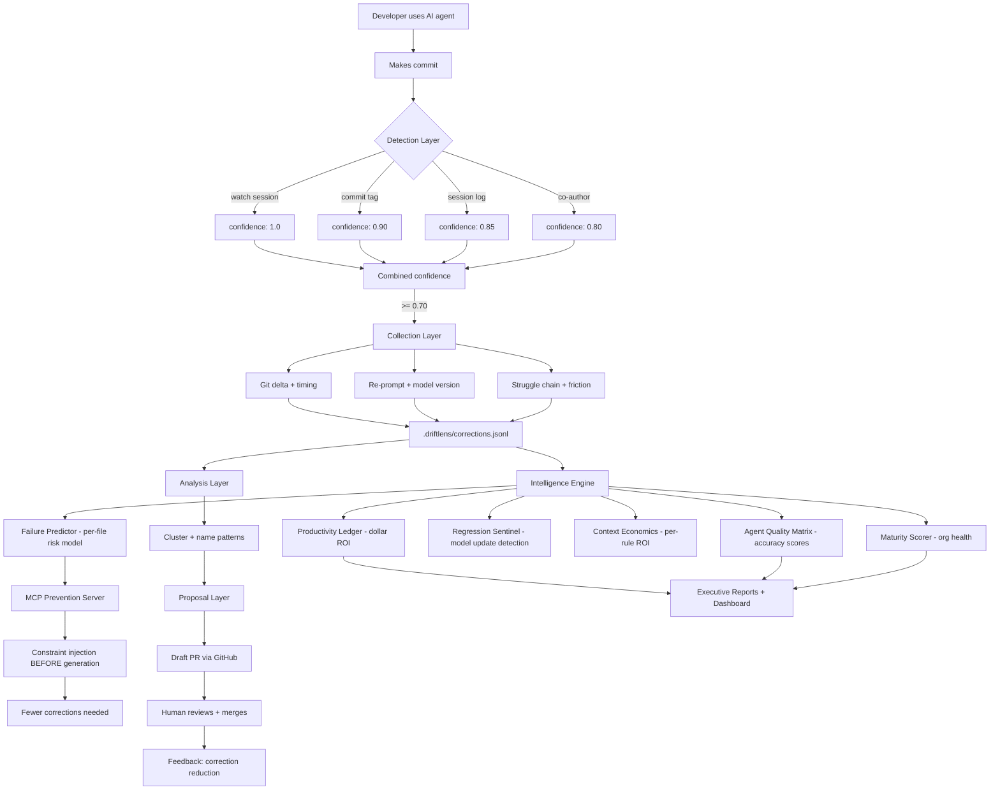

# DriftLens - How It Works

## The Intelligence Platform Architecture



## The 5 Layers

### Layer 0: Observation (Passive, Zero Friction)

| Signal | Source | New in v0.2 |
|---|---|---|
| Git delta | post-commit hook | ✓ timing data |
| Re-prompt | session log parsers | ✓ model version |
| Struggle chain | multi-turn detection | ✓ friction economics |
| Agent identification | metadata extraction | ✓ exact model version |
| Generation timing | timestamp capture | **NEW** |

### Layer 1: Intelligence Engine (The Brain)

| Capability | What it computes | Output |
|---|---|---|
| Productivity Ledger | time saved vs time lost → dollar ROI | `driftlens roi` |
| Agent Quality Matrix | per-agent accuracy by file type | `driftlens agents` |
| Failure Predictor | per-file mistake probability | `driftlens predict` |
| Regression Sentinel | model update → correction spike | `driftlens regression` |
| Context Economics | per-rule token cost vs value | `driftlens trim` |
| Maturity Scorer | composite org health (0-100) | `driftlens health` |

### Layer 2: Prevention (Real-Time)

DriftLens runs an MCP server that any agent can connect to. When an agent is about to generate code, it queries DriftLens for file-specific constraints:

```
Agent → "I'm about to edit AuthService.ts"
DriftLens → "CONSTRAINTS: (1) Use authService singleton, (2) Import from @/services, (3) Never use new"
Agent → Generates code following constraints
Result → No correction needed ✓
```

### Layer 3: Skill Improvement

Same as before (pattern analysis + PR proposals) but enhanced with:
- Cross-agent propagation (rule in CLAUDE.md → auto-propagate to .cursorrules)
- Regression-triggered re-proposals (model broke a pattern → strengthen the rule)
- Economics-driven archival (rule has 0× ROI → suggest removal)

### Layer 4: Reporting

| Audience | Report | Access |
|---|---|---|
| Developer | Dashboard, predictions, scores | `driftlens dashboard` |
| Eng Manager | Team ROI, productivity trends | `driftlens roi --team` |
| VP/CTO | Maturity score, benchmarks | `driftlens report --executive` |
| CFO | Dollar ROI, tool cost justification | `driftlens roi --export pdf` |
